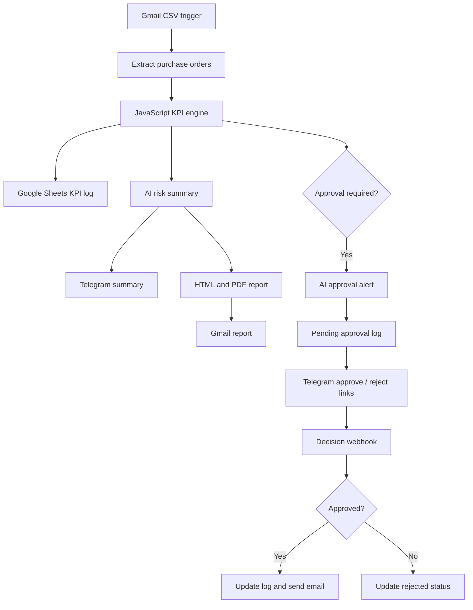
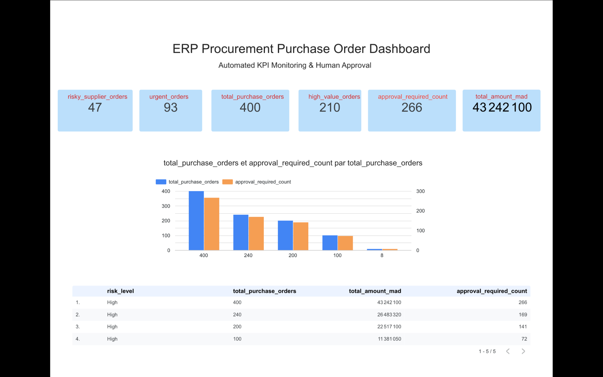
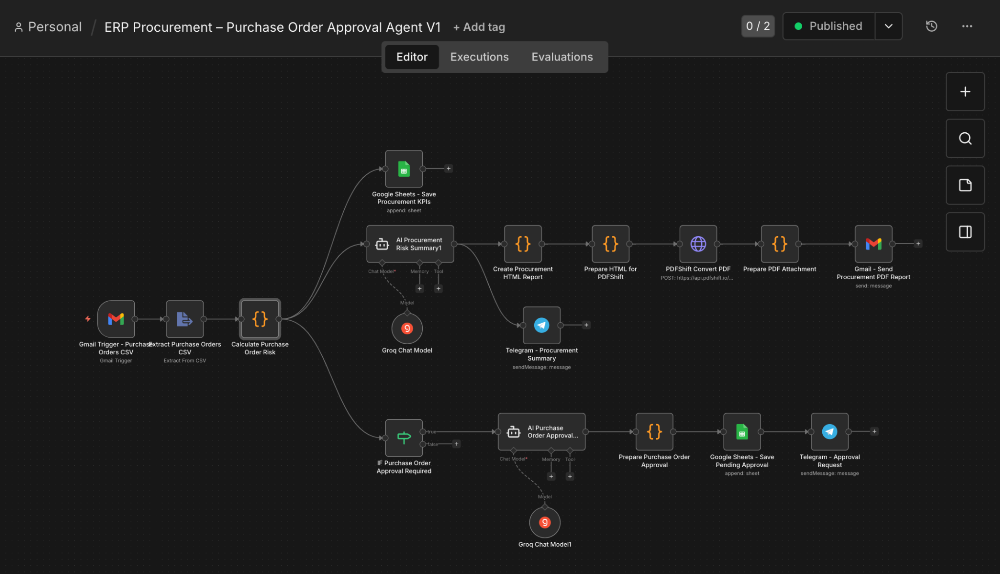
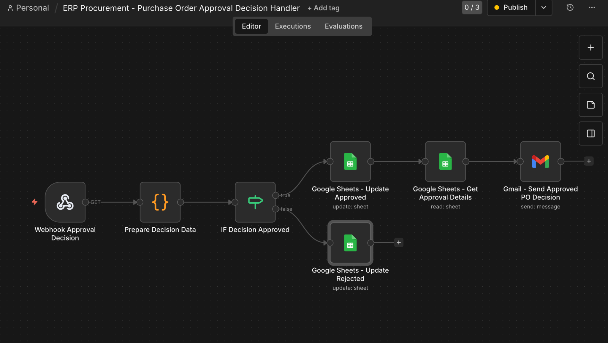
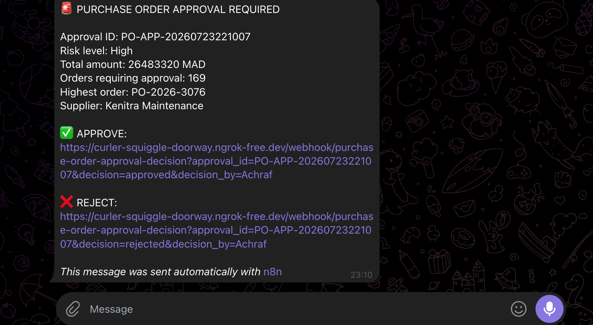

# ERP Procurement Approval Agent

[Version française](README_FR.md)


An end-to-end procurement risk automation built with n8n. It receives purchase
orders by email, calculates operational KPIs, detects sensitive orders, creates
an AI-assisted risk report, stores the results, requests human approval, and
notifies the procurement team.

**Live dashboard:** [Open the Looker Studio report](https://datastudio.google.com/reporting/04a11ef9-b9a4-4c33-b2f9-e8e3e4d7866c/page/1Lf4F)

## Business problem

Procurement teams often review high-value, urgent, duplicate, or risky-supplier
orders manually. This slows down validation, increases financial exposure, and
makes the approval history difficult to audit.

This project turns a CSV purchase-order file into a repeatable control process:

1. Receive and extract purchase orders.
2. Calculate procurement risk KPIs.
3. Store the execution history in Google Sheets.
4. Generate an AI risk summary and PDF report.
5. Send reporting through Telegram and Gmail.
6. Request human approval for sensitive orders.
7. Record the approval or rejection decision.

## Architecture



## Main features

- Gmail trigger with CSV attachment filtering
- CSV extraction and field normalization
- JavaScript KPI and rule engine
- Risk classification: Low, Medium, or High
- Groq-powered procurement analysis
- Google Sheets KPI and approval logs
- PDF procurement risk report
- Gmail and Telegram notifications
- Human-in-the-loop approval with webhook links
- Looker Studio monitoring dashboard
- Test datasets containing 100, 200, 240, and 400 purchase orders

## KPIs and control rules

| KPI | Logic |
|---|---|
| Total purchase orders | Number of CSV rows |
| Total amount | Sum of `amount_mad` |
| High-value orders | Amount greater than or equal to 100,000 MAD |
| Risky-supplier orders | Supplier risk is High, Blocked, or equivalent |
| Urgent orders | Urgency is Urgent, High, Critical, or equivalent |
| Duplicate orders | Repeated purchase-order ID |
| Approval required | High value, risky supplier, duplicate, or urgent order above 50,000 MAD |
| Global risk | High when high-value, risky-supplier, or duplicate orders exist |

## Verified test result

The 400-order test produced:

| KPI | Result |
|---|---:|
| Total purchase orders | 400 |
| Total amount | 43,242,100 MAD |
| High-value orders | 210 |
| Risky-supplier orders | 47 |
| Urgent orders | 93 |
| Orders requiring approval | 266 |
| Global risk | High |

## Project screenshots

### Looker Studio dashboard



### Main n8n workflow



### Approval decision handler



### Human approval request



Additional screenshots are available in
[`docs/screenshots`](docs/screenshots).

## Repository structure

```text
erp-procurement-approval-agent/
├── README.md
├── README_FR.md
├── LICENSE
├── SECURITY.md
├── .env.example
├── .gitignore
├── workflows/
│   ├── erp-procurement-approval-agent.json
│   └── purchase-order-approval-decision-handler.json
├── sample-data/
│   ├── purchase-orders-100.csv
│   ├── purchase-orders-200.csv
│   ├── purchase-orders-240.csv
│   └── purchase-orders-400.csv
├── sample-output/
│   └── sample-procurement-risk-report.pdf
└── docs/
    ├── SETUP.md
    ├── google-sheets-schema.md
    └── screenshots/
```

## Quick start

### Requirements

- n8n
- Gmail OAuth credential
- Google Sheets OAuth credential
- Telegram bot credential
- Groq API credential
- PDFShift API key
- A public HTTPS n8n webhook URL

### Installation

1. Import both JSON files from [`workflows`](workflows) into n8n.
2. Connect your Gmail, Google Sheets, Telegram, and Groq credentials.
3. Replace all `YOUR_...` placeholders in the nodes.
4. Create the two Google Sheets tabs described in
   [`docs/google-sheets-schema.md`](docs/google-sheets-schema.md).
5. Set your production webhook URL in `Prepare Purchase Order Approval`.
6. Publish the decision-handler workflow first.
7. Publish the main workflow.
8. Email a sample CSV with the subject `ERP Purchase Orders`.

The detailed checklist is available in [`docs/SETUP.md`](docs/SETUP.md).

## Input format

```csv
index,po_id,supplier_name,amount_mad,supplier_risk,urgency
1,PO-2026-1001,Atlas Packaging,125000,High,Urgent
```

## Security

The public workflow templates contain placeholders only. Credentials and
personal identifiers were removed from the exports. Never commit a real API key
or a credential-enabled workflow export.

See [`SECURITY.md`](SECURITY.md) before deployment.

## Technology stack

- n8n
- JavaScript
- Groq / LLM agents
- Gmail
- Google Sheets
- Telegram Bot API
- PDFShift
- Looker Studio
- Webhooks and JSON

## Business value

- Faster review of sensitive purchase orders
- Consistent procurement control rules
- Traceable human decisions
- Automated operational reporting
- Better visibility into supplier, urgency, and financial risk

## Author

**Achraf Sifaddine**  
E-Logistics, Data Analytics, and AI Workflow Automation

## License

This project is available under the [MIT License](LICENSE).
