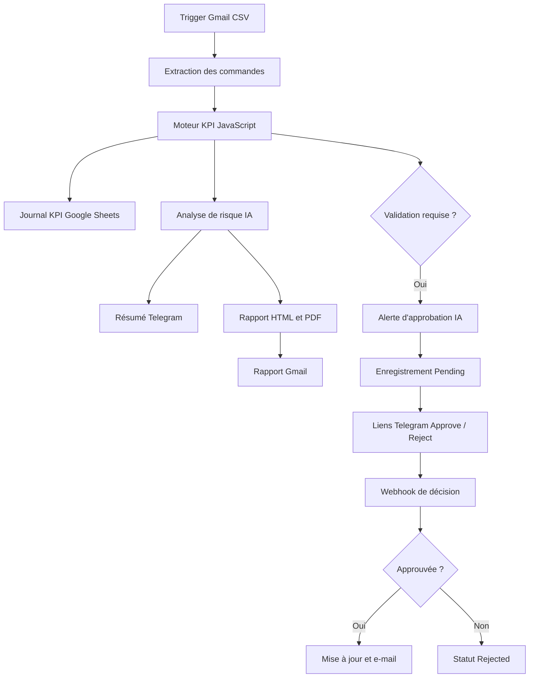

# Agent de validation des commandes d'achat ERP

[English version](README.md)


Automatisation complète du contrôle des risques achats avec n8n. Le workflow
reçoit les commandes d'achat par e-mail, calcule les KPI, détecte les commandes
sensibles, produit un rapport assisté par IA, stocke les résultats, demande une
validation humaine et notifie l'équipe procurement.

**Dashboard :** [ouvrir le rapport Looker Studio](https://datastudio.google.com/reporting/04a11ef9-b9a4-4c33-b2f9-e8e3e4d7866c/page/1Lf4F)

## Problème métier

Les équipes achats contrôlent souvent manuellement les commandes de valeur
élevée, urgentes, en doublon ou associées à des fournisseurs risqués. Ce
traitement ralentit la validation, augmente l'exposition financière et rend
l'historique des décisions difficile à auditer.

Ce projet transforme un fichier CSV de commandes d'achat en processus de
contrôle reproductible :

1. Réception et extraction des commandes.
2. Calcul des KPI de risque achats.
3. Enregistrement de l'historique dans Google Sheets.
4. Génération d'une analyse IA et d'un rapport PDF.
5. Envoi du reporting par Telegram et Gmail.
6. Demande de validation humaine pour les commandes sensibles.
7. Enregistrement de la décision d'approbation ou de rejet.

## Architecture



## Fonctionnalités principales

- Trigger Gmail filtrant les pièces jointes CSV
- Extraction CSV et normalisation des champs
- Moteur de règles et de KPI en JavaScript
- Classification du risque : Low, Medium ou High
- Analyse procurement générée avec Groq
- Journaux KPI et approbations dans Google Sheets
- Rapport PDF de risque achats
- Notifications Gmail et Telegram
- Validation humaine par liens webhook
- Dashboard de suivi dans Looker Studio
- Jeux de test de 100, 200, 240 et 400 commandes

## KPI et règles de contrôle

| KPI | Logique |
|---|---|
| Total des commandes | Nombre de lignes du CSV |
| Montant total | Somme de `amount_mad` |
| Commandes de valeur élevée | Montant supérieur ou égal à 100 000 MAD |
| Fournisseurs risqués | Risque High, Blocked ou équivalent |
| Commandes urgentes | Urgence Urgent, High, Critical ou équivalent |
| Doublons | Identifiant de commande répété |
| Validation requise | Valeur élevée, fournisseur risqué, doublon ou commande urgente supérieure à 50 000 MAD |
| Risque global | High si une commande de valeur élevée, risquée ou en doublon existe |

## Résultat de test vérifié

Le test de 400 commandes a produit :

| KPI | Résultat |
|---|---:|
| Total des commandes | 400 |
| Montant total | 43 242 100 MAD |
| Commandes de valeur élevée | 210 |
| Commandes avec fournisseur risqué | 47 |
| Commandes urgentes | 93 |
| Commandes nécessitant une validation | 266 |
| Risque global | High |

## Captures du projet

### Dashboard Looker Studio


### Workflow n8n principal


### Workflow de traitement des décisions


### Demande de validation humaine


Les autres captures sont disponibles dans
[`docs/screenshots`](docs/screenshots).

## Structure du dépôt

```text
erp-procurement-approval-agent/
├── README.md
├── README_FR.md
├── LICENSE
├── SECURITY.md
├── .env.example
├── .gitignore
├── workflows/
├── sample-data/
├── sample-output/
└── docs/
```

## Installation rapide

### Prérequis

- n8n
- Identifiants OAuth Gmail et Google Sheets
- Bot Telegram
- Identifiant API Groq
- Clé API PDFShift
- URL webhook n8n publique en HTTPS

### Mise en place

1. Importe les deux fichiers JSON du dossier [`workflows`](workflows).
2. Reconnecte Gmail, Google Sheets, Telegram et Groq dans n8n.
3. Remplace toutes les valeurs `YOUR_...`.
4. Crée les deux onglets décrits dans
   [`docs/google-sheets-schema.md`](docs/google-sheets-schema.md).
5. Ajoute ton URL de production dans `Prepare Purchase Order Approval`.
6. Publie d'abord le workflow de traitement des décisions.
7. Publie ensuite le workflow principal.
8. Envoie un CSV de test avec l'objet `ERP Purchase Orders`.

La checklist détaillée se trouve dans [`docs/SETUP.md`](docs/SETUP.md).

## Format d'entrée

```csv
index,po_id,supplier_name,amount_mad,supplier_risk,urgency
1,PO-2026-1001,Atlas Packaging,125000,High,Urgent
```

## Sécurité

Les workflows publics contiennent uniquement des valeurs de remplacement. Les
identifiants, clés et informations personnelles ont été supprimés des exports.
Ne publie jamais une vraie clé API ou un export contenant des credentials.

Consulte [`SECURITY.md`](SECURITY.md) avant le déploiement.

## Technologies

- n8n
- JavaScript
- Groq / agents IA
- Gmail
- Google Sheets
- Telegram Bot API
- PDFShift
- Looker Studio
- Webhooks et JSON

## Valeur métier

- Validation plus rapide des commandes sensibles
- Règles de contrôle homogènes
- Décisions humaines traçables
- Reporting opérationnel automatisé
- Visibilité sur les risques fournisseurs, financiers et d'urgence

## Auteur

**Achraf Sifaddine**  
E-Logistique, Data Analytics et automatisation de workflows IA

## Licence

Ce projet est disponible sous [licence MIT](LICENSE).
